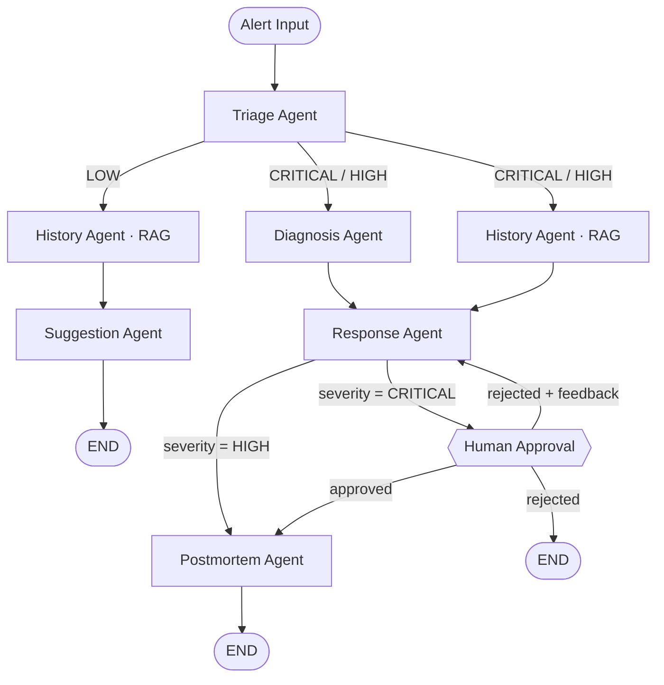

# Incident Response Autopilot

Учебный pet-проект для отработки трёх MAS-паттернов на LangGraph: conditional routing, fan-out/fan-in, human-in-the-loop. Доменом выбран incident response — близкая мне область из 17 лет в IT-управлении, последние из которых я отвечал за delivery и observability в продуктах крупного банка.

Цель проекта — не построить production-сервис, а пройти ключевые архитектурные паттерны мультиагентных систем на доменно осмысленной задаче, а не на туториальных примерах с погодой и калькулятором.

---


---

## Зачем я это сделал

В предыдущей роли я снизил MTTR с 1–2 часов до 10–15 минут через стандартизацию метрик и observability-программу — руками, с командой, без AI. Когда начал погружаться в LangGraph и LLM-агентов, захотелось увидеть, как тот же процесс выглядит в архитектуре MAS: где проходит граница между orchestrated workflow и autonomous-агентами, какие паттерны действительно нужны для production-подобной задачи, а какие — академическая красота из примеров.

Incident response для этого хороший домен: процесс понятный (triage → diagnosis → response → postmortem), есть явные точки ветвления по severity, есть естественная необходимость в human-in-the-loop на критичных решениях. То есть все три паттерна оправданы доменом, а не натянуты ради демонстрации.

---

## Что в проекте есть и чего сознательно нет

| Реализовано | Сознательно за рамками |
|---|---|
| Граф из 5 LLM-агентов + RAG-узел на LangGraph | Реальные runbook'и из production — синтетические данные сознательно |
| Conditional routing по severity (CRITICAL / HIGH / LOW) | Alertmanager / Datadog webhook — ручной ввод JSON в Streamlit |
| Параллельный fan-out (Diagnosis + History) c кастомным reducer | Persistent checkpointer — `MemorySaver` в памяти процесса |
| Human-in-the-loop через interrupt + три исхода (approve / reject / reject+feedback) | Retry / timeout на LLM-вызовах |
| RAG на ChromaDB embedded с идемпотентным ingestion | Evaluation-фреймворк (RAGAS, LLM-as-judge) |
| Pydantic v2 schemas для structured output каждого агента | Multi-tenancy, RBAC, аудит-логи |
| LangSmith-трассировка + JSONL-метрики (cost, latency per agent) | FastAPI / production frontend — Streamlit как UI-каркас |
| Тесты на routing-логику и агентов с моками | CI/CD, контейнеризация, k8s-манифесты |

Граница MVP проведена осознанно: всё, что слева — это паттерны, которые я хотел понять руками. Всё, что справа — это инженерия, которую я знаю как делать в общем виде, но в учебном проекте она не добавила бы понимания.

---

## Граф агентов



| Узел | Задача | Модель | Обоснование выбора |
|---|---|---|---|
| `triage` | Классификация severity и типа инцидента | Claude Haiku 4.5 | Шаблонная классификация, важна скорость и дешевизна |
| `diagnosis` | Root cause analysis по симптомам алерта | Claude Sonnet 4.5 | Требует рассуждений, не сводится к шаблону |
| `history` | Dense retrieval по runbooks / postmortems / playbooks | — (RAG, без LLM) | Lookup, а не reasoning — детерминированный поиск надёжнее LLM-парафраза |
| `response` | Сборка плана реагирования из диагноза + истории | Claude Haiku 4.5 | Шаблонная агрегация структурированных входов |
| `human_approval` | Interrupt-точка, граф ждёт инженера | — | Намеренно без LLM — это точка контроля, не автоматика |
| `postmortem` | Timeline + action items | Claude Haiku 4.5 | Шаблонная структура, входы уже подготовлены |
| `suggestion` | Лёгкая рекомендация для LOW-инцидентов | Claude Haiku 4.5 | Короткий путь, минимальный context |

**Почему History Agent без LLM.** RAG здесь — это `embed(query) → cosine distance → top-k`. Если добавить LLM-слой между поиском и результатом, появляется недетерминированность там, где нужна воспроизводимость. Агент — это не обязательно «узел с LLM», агент — это автономная единица с чётким контрактом input/output.

---

## Три паттерна и как они реализованы

### 1. Conditional routing по severity

Граф ветвится в зависимости от severity. CRITICAL/HIGH идут через дорогой путь (Diagnosis + History параллельно → Response → Postmortem), LOW — через лёгкий (History → Suggestion). Реализация — через `add_conditional_edges` и чистые routing-функции в [src/graph/routing.py](./src/graph/routing.py), которые покрыты тестами в [tests/test_routing.py](./tests/test_routing.py).

### 2. Fan-out / fan-in

Diagnosis и History запускаются одновременно, Response ждёт оба. Latency = `max(Diagnosis, History)`, не сумма.

Подводный камень, которого нет в туториалах: **параллельные узлы пишут в один dict в state, и LangGraph по умолчанию падает с ошибкой конкурентной записи**. Решение — кастомный reducer на поле metrics:

```python
# src/graph/state.py
class IncidentState(TypedDict, total=False):
    metrics: Annotated[dict[str, Any], _merge_dicts]   # reducer для fan-out
```

### 3. Human-in-the-loop через interrupt

Для CRITICAL граф физически останавливается перед `human_approval`-узлом, ожидает решения инженера и продолжается через `Command(resume=...)`. Три исхода: approve → постмортем; reject + feedback → план перегенерируется с учётом замечаний; reject → END без постмортема.

В проекте используется паттерн `interrupt_before=["human_approval"]` + `MemorySaver`. Это рабочий и полностью поддержанный API, но в LangGraph 1.x более идиоматичный путь — функция `interrupt()` непосредственно внутри узла. На следующей итерации перепишу эту часть на новый API.

---

## Почему orchestrated, а не autonomous MAS

В фокусе MVP — три конкретных паттерна, перечисленных выше. Autonomous-агенты с emergent routing (стиль AutoGen, blackboard-архитектуры) — отдельная большая тема, добавление которой увеличило бы scope проекта в разы и размыло учебную цель. Заведено в backlog как отдельный этап.

---

## Цифры запусков

9 прогонов на синтетических алертах. Цифры показывают порядок величин и подтверждают экономическую разницу между путями графа — не качество предсказаний.

| Метрика | CRITICAL | HIGH | LOW |
|---|---|---|---|
| End-to-end latency | 22–28 сек | 20–22 сек | 6–10 сек |
| Стоимость / инцидент | $0.014–0.017 | $0.012–0.013 | $0.003–0.005 |
| Bottleneck | Diagnosis Agent | Diagnosis Agent | Suggestion Agent |

Что отсюда видно: LOW-инциденты обходятся в 3–4 раза дешевле и заканчиваются в 2–3 раза быстрее CRITICAL. Conditional routing по severity — не архитектурная декорация, на типичном mix'е инцидентов это материальная разница в стоимости и latency.

Чего отсюда **не** видно: качества классификации, корректности диагноза, релевантности retrieval. Это требует RAGAS / LLM-as-judge на размеченном датасете — за рамками MVP, заведено в backlog.

---

## Architecture Decisions

**LangGraph, а не LangChain AgentExecutor / CrewAI.** AgentExecutor и CrewAI хороши для линейных пайплайнов, но скрывают граф за абстракцией. На этой задаче нужен явный stateful граф с conditional edges, fan-out и interrupt — это базовые примитивы LangGraph, в других фреймворках они либо отсутствуют, либо реализуются обходными путями.

**Anthropic Claude API.** Нативный structured output через Pydantic-схему: ответ либо парсится в типизированную модель, либо API возвращает ошибку. Никаких регулярок по JSON, никакого fallback-парсинга. Две модели по задачам: Haiku 4.5 на шаблонные узлы (triage, response, postmortem, suggestion), Sonnet 4.5 на diagnosis. Sonnet везде — переплата 3–5x без разницы в результате на шаблонных задачах.

**ChromaDB embedded.** Нулевая инфраструктура для pet-проекта. Knowledge base индексируется идемпотентно — стабильный `sha256(path:chunk_idx)` как ID документа, повторный ingestion не создаёт дубликатов. Логи retriever'а пишут query, top_k, scores, source_ids — заготовка под RAGAS-evaluation.

**Pydantic v2 везде.** Каждый агент возвращает `BaseModel`, не raw dict: валидация на стороне SDK, предсказуемые поля для следующих узлов, бесплатная JSON-сериализация для логов и LangSmith.

**Streamlit как UI.** Human-in-the-loop форма с live-стримингом нужна была за вечер, а не за неделю. `graph.stream(stream_mode="updates")` + `st.status()` — каждый узел отрисовывается по мере готовности, fan-out явно виден как две параллельные колонки. На production это, очевидно, был бы FastAPI + отдельный фронтенд.

---

## Если бы делал это всерьёз

Это учебный проект, и некоторые решения сознательно упрощены. Если бы это был реальный production-сервис, следующими шагами были бы:

- **Persistent checkpointer** — Redis или Postgres вместо `MemorySaver`, чтобы граф переживал рестарты процесса
- **Retry + timeout с exponential backoff** на LLM-вызовах — в данных уже видны задержки до 83 секунд на одном вызове
- **Alertmanager / Datadog webhook** вместо ручного ввода JSON в UI
- **RAGAS-evaluation в CI** — для retrieval уже логируются нужные поля
- **Vector DB с горизонтальным масштабированием** — Qdrant или Weaviate вместо embedded ChromaDB
- **Self-improving loop** — постмортемы, одобренные инженером, индексируются обратно в knowledge base
- **Эксперимент с autonomous-агентами** — как отдельная ветка, для сравнения latency / cost / предсказуемости с текущим orchestrated-подходом

Каждый из этих пунктов добавил бы инженерной работы, но не дал бы новых инсайтов по ключевым MAS-паттернам, которые были целью проекта.

---

## Стек

| Компонент | Технология | Версия |
|---|---|---|
| Оркестрация графа | LangGraph | ≥ 0.2 |
| LLM | Anthropic Claude API (Haiku 4.5 + Sonnet 4.5) | SDK ≥ 0.40 |
| Structured output | Pydantic v2 | ≥ 2.0 |
| Векторная БД | ChromaDB embedded | ≥ 0.5 |
| UI | Streamlit | ≥ 1.40 |
| Tracing | LangSmith | ≥ 0.1 |
| Тесты | pytest + pytest-mock | ≥ 8.0 |
| Линт / типы | ruff + mypy --strict | — |
| Package manager | uv | — |

---

## Quickstart

```bash
# 1. Зависимости
uv sync

# 2. API-ключ
cp .env.example .env
# вписать ANTHROPIC_API_KEY=sk-ant-... (опционально LANGSMITH_API_KEY)

# 3. UI
uv run streamlit run ui/app.py

# 4. Тесты
uv run pytest
uv run pytest tests/test_routing.py -v
```

---

## Структура репозитория

```
src/
├── agents/                  # 5 LLM-агентов + history (RAG)
│   ├── <name>_schema.py     #  Pydantic-модель ответа
│   ├── <name>_prompts.py    #  system prompt + сборщик user prompt
│   └── <name>_agent.py      #  узел графа: messages.parse() + metrics
├── graph/
│   ├── state.py             # IncidentState (TypedDict с reducer для metrics)
│   ├── routing.py           # 4 чистые routing-функции
│   └── workflow.py          # сборка графа, interrupt_before, checkpointer
├── rag/
│   ├── ingestion.py         # ChromaDB ingestion (идемпотентный, sha256 ID)
│   └── retriever.py         # dense search + логи под RAGAS
├── monitoring/
│   └── metrics.py           # cost-калькуляция, агрегации, JSONL persistence
└── config.py                # pydantic-settings (.env)

ui/
├── app.py                   # main page: streaming + human-in-the-loop
└── pages/metrics.py         # дашборд cost / latency / approve-rate

data/sample_data/
├── incidents/               # 7 синтетических алертов (CRITICAL / HIGH / LOW)
└── knowledge_base/          # runbooks (7), postmortems (5), playbooks (4)

tests/
├── test_routing.py          # ветки графа
├── test_agents.py           # каждый LLM-агент с моком _llm
├── test_rag.py              # ingestion + retriever
└── test_metrics.py          # cost-калькуляция, агрегации
```

---

## Контакты

Проект сделан в рамках перехода в направление AI / MAS.

[Telegram](https://t.me/kir_ngv) · [career@nagayev.ru](mailto:career@nagayev.ru)
