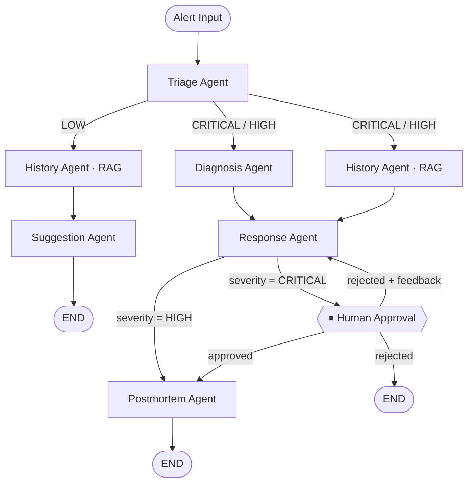

# Incident Response Autopilot

**Orchestrated multi-agent system** для автоматической диагностики production-инцидентов:
от алерта до постмортема за 10–28 секунд, с явным контролем инженера на критичных решениях.

> **Личный контекст.** В предыдущей роли я снизил MTTR с 1–2 часов до 10–15 минут
> через стандартизацию метрик и observability-программу - руками, с командой.
> Этот проект - попытка автоматизировать тот же процесс через AI:
> не «ассистент, который пишет за инженера», а **конвейер, который проводит инцидент по
> процессу**, сохраняя контроль человека там, где цена ошибки максимальна.

---


---

## Проблема и контекст

**Для кого:** SRE / on-call engineer в команде с ≥10 сервисами в production.

**Что болит:** медианный MTTR в индустрии - 60–90 минут; первые 15 минут уходят на
классификацию инцидента, поиск похожих случаев и сборку первичного плана реагирования.
Это рутина, которая поддаётся структуризации, - но без инструментов каждый раз
делается заново, с нуля, под стрессом.

**Что автоматизирует этот проект:**
- Классификацию severity и типа инцидента (triage).
- Параллельный поиск похожих инцидентов / runbooks / playbooks (RAG).
- Первичную диагностику root cause.
- Генерацию плана реагирования с привязкой к конкретным runbook-шагам.
- Финальный постмортем с timeline и action items.

**Граница ответственности:** система не принимает решений автономно на CRITICAL-инцидентах.
Инженер физически подтверждает каждый план через Human-in-the-loop паузу; без подтверждения
постмортем не создаётся.

---

## Реальные цифры (9 прогнанных инцидентов)

| Метрика | CRITICAL | HIGH | LOW |
|---|---|---|---|
| End-to-end latency | 22–28 сек | 20–22 сек | 6–10 сек |
| Стоимость / инцидент | $0.014–0.017 | $0.012–0.013 | $0.003–0.005 |
| Approve без правок | 75% (3 из 4) | 100% (2 из 2) | - |
| Основной bottleneck | Diagnosis Agent | Diagnosis Agent | Suggestion Agent |


**Что это значит:** LOW-инциденты обходятся в 3–4x дешевле и заканчиваются в 2–3x быстрее
CRITICAL. Conditional routing по severity - это не просто архитектура, это прямая
экономия операционных расходов.

---

## Демо-сценарий

```
[Alert JSON]  →  Triage (severity, type)
                    ├──→ Diagnosis  ─┐  (параллельно, fan-out)
                    └──→ History    ─┴──→ Response Plan
                                              │
                                          if CRITICAL
                                              ▼
                                       ⏸  Human Approval   ← инженер подтверждает здесь
                                              │
                                              ▼
                                          Postmortem
```

Запуск: `streamlit run ui/app.py` → выбрать пресет (CRITICAL / HIGH / LOW) →
смотреть, как граф стримится в реальном времени, Diagnosis и History - двумя
параллельными колонками.

---

## Граф агентов



| Узел | Что делает | Модель | Почему эта модель |
|---|---|---|---|
| `triage` | Классифицирует severity (CRITICAL/HIGH/LOW) и тип (performance/availability/data) | Claude Haiku 4.5 | Шаблонная классификация, нужна скорость ($0.001–0.002) |
| `diagnosis` | Root cause analysis: что сломалось и почему | Claude Sonnet 4.5 | Требует рассуждений, не шаблон |
| `history` | Dense retrieval по базе runbooks/postmortems/playbooks | - (RAG, без LLM) | Lookup, а не reasoning; детерминированный поиск надёжнее LLM-парафраза |
| `response` | Агрегирует диагноз + историю → конкретный план с runbook-шагами | Claude Haiku 4.5 | Шаблонная сборка из структурированных входов |
| `human_approval` | Interrupt-точка: граф стоит, ждёт инженера | - | Намеренно без LLM - это точка контроля, не автоматика |
| `postmortem` | Timeline + action items | Claude Haiku 4.5 | Шаблонная структура, входы уже готовы |
| `suggestion` | Лёгкая рекомендация для LOW-инцидентов | Claude Haiku 4.5 | Короткий путь, минимальный context |

> **Почему History Agent без LLM?** RAG - это lookup: embed(query) → cosine distance →
> top-k документов. Добавлять LLM-слой между поиском и результатом означало бы вносить
> недетерминированность туда, где нужна воспроизводимость. Агент - это не обязательно
> «узел с LLM»; агент - это автономная единица с чётким контрактом input/output.

---

## Три ключевых паттерна

### 1. Conditional Routing по severity
Граф ветвится по severity: CRITICAL/HIGH - дорогой путь (Diagnosis + History параллельно
→ Response → Postmortem), LOW - лёгкий (History → Suggestion).
Реализовано через `add_conditional_edges` и чистые routing-функции
в [src/graph/routing.py](src/graph/routing.py).

**В цифрах:** LOW обходится в $0.003–0.005 против $0.014–0.017 для CRITICAL.
«Не запускать Diagnosis на диск 78%» - это не архитектурная красота,
это экономия cost'а в 3–4x на типичном mix'е инцидентов.

### 2. Fan-out / Fan-in
Diagnosis и History запускаются одновременно (LangGraph fan-out), Response ждёт оба
(fan-in). Latency = max(Diagnosis, History), не сумма.

**Подводный камень.** Параллельные узлы пишут в один dict `state["metrics"]`.
LangGraph по умолчанию падает с ошибкой конкурентной записи. Решение - кастомный
reducer:

```python
# src/graph/state.py
class IncidentState(TypedDict, total=False):
    metrics: Annotated[dict[str, Any], _merge_dicts]   # ← reducer для fan-out
```

### 3. Human-in-the-loop через interrupt
Для CRITICAL граф **физически останавливается** перед `human_approval` через
`interrupt_before=["human_approval"]` + `MemorySaver` checkpointer. Возобновление -
через `graph.update_state(thread_id, ...)` + `graph.stream(None, config)`.

Три исхода:
- **Approve** → постмортем.
- **Reject + feedback** → план перегенерируется с учётом замечаний, цикл до Approve.
- **Reject** → END без постмортема.

**Почему это важно для incident response:** автономное действие на CRITICAL -
это риск. Инженер должен явно взять ответственность. Human-in-the-loop здесь - не UX-фича,
а процессная необходимость, от которой нельзя отказаться ради скорости.

---

## Почему orchestrated, а не autonomous MAS

Это сознательный trade-off, требующий объяснения.

**Что я сделал:** построил orchestrated workflow - LangGraph граф явно определяет,
какой агент когда запускается, какие данные получает, куда передаёт результат.
Агенты не общаются напрямую, не имеют собственной памяти, не принимают решений
о следующем шаге.

**Почему не автономные агенты (peer-to-peer, blackboard, emergent routing):**

1. **Аудит и compliance.** Каждый CRITICAL-инцидент оставляет LangSmith trace
   с полным деревом решений. «Почему система так отреагировала?» - ответ в
   одном trace, а не в распределённых агент-агентных переговорах.

2. **Предсказуемость cost.** Autonomous LLM-router может «решить» добавить
   дополнительный reasoning loop. Детерминированный граф - нет. Cost per incident
   предсказуем (±20%).

3. **Human-in-the-loop требует паузы в известной точке.** Если граф emergent, непонятно,
   где вставить interrupt. Если граф явный - `interrupt_before=["human_approval"]`
   и готово.

4. **Инциденты - это процесс, не задача.** ITIL/SRE playbook'и описывают конкретные
   шаги: triage → diagnosis → response → postmortem. Это не та область, где
   emergent behavior добавляет ценность.

**Trade-off:** система не может адаптировать маршрут при нестандартных инцидентах.
Новый тип инцидента требует явного изменения графа. Это принятое ограничение MVP.

---

## Architecture Decisions

### Почему LangGraph, а не LangChain AgentExecutor / CrewAI
AgentExecutor и CrewAI хороши для линейных пайплайнов, но скрывают граф за
абстракцией. Здесь нужен явный stateful граф с conditional edges, fan-out и
interrupt'ом - это базовые примитивы LangGraph, не надстройки.

### Почему Anthropic Claude, а не OpenAI
`messages.parse(output_format=PydanticModel)` - нативный structured output:
ответ либо парсится в типизированную модель, либо API возвращает ошибку.
Никаких регулярок по JSON, никакого fallback на «почти JSON».

Две модели по задачам:
- **Haiku 4.5** - Triage / Response / Postmortem / Suggestion (шаблонные задачи, $0.001–0.005).
- **Sonnet 4.5** - Diagnosis (нужен reasoning, не шаблон, $0.003–0.004).

### Почему ChromaDB embedded
Нулевая инфраструктура для pet-проекта. Knowledge base индексируется идемпотентно
(стабильный `sha256(path:chunk_idx)` ID). Логи retriever'а пишут query, top_k,
scores, source_ids - заготовка под RAGAS-evaluation в v2.

### Почему Streamlit
Human-in-the-loop-форма с live-стримингом нужна была за один вечер, не за неделю.
`graph.stream(stream_mode="updates")` + `st.status()` - каждый узел отрисовывается
по мере готовности, fan-out явно виден как две параллельные колонки.

### Почему Pydantic v2 везде
Каждый агент возвращает `BaseModel`, не raw dict:
- валидация формата на стороне SDK Anthropic;
- предсказуемые поля для следующих узлов;
- бесплатная JSON-сериализация для логов и LangSmith.

---

## Trade-offs, принятые сознательно

| Что выбрал | От чего отказался | Почему |
|---|---|---|
| Граф с явным порядком шагов | Агенты общаются напрямую | Если что-то пошло не так — сразу видно, на каком шаге и почему |
| Общее состояние для всех агентов | Своя память у каждого агента | Один источник данных — нет рассинхронизации между шагами |
| Маршрут по severity задан жёстко | LLM сам решает, куда идти | LLM не должен «придумывать» маршрут; стоимость каждого инцидента предсказуема |
| Обязательное подтверждение инженера на CRITICAL | Полностью автоматическая обработка | На критичных инцидентах человек должен явно взять ответственность за план |
| Haiku для рутинных шагов | Sonnet везде | Sonnet на сортировке алертов — переплата в 3–5x без разницы в результате |
| ChromaDB без отдельного сервера | Qdrant/Weaviate | Не нужна инфраструктура для пет-проекта; в production-версии будет другое (см. ниже) |
| Синтетическая база знаний | Реальные runbooks компании | Реальные данные — в реальной компании; структура готова, данные подставляются |

---

## Что изменить для production

Сознательные упрощения MVP и их production-замены:

| MVP | Production |
|---|---|
| ChromaDB embedded (sqlite) | Qdrant / Weaviate с horizontal scaling |
| `MemorySaver` (in-memory checkpointer) | Redis / PostgreSQL checkpointer (persist между рестартами) |
| Streamlit UI | FastAPI backend + отдельный frontend (React / Next.js) |
| Ручной JSON алерта | Alertmanager webhook (POST `/incident`) |
| Синтетические sample incidents | Реальные алерты из Prometheus / Datadog |
| Eval в v2 backlog | RAGAS + LLM-as-judge в CI/CD pipeline |
| Timeout не обрабатывается | Circuit breaker + retry с exponential backoff на LLM-вызовах |

---

## Failure Modes

Где система может ошибиться и что с этим делается сейчас:

| Failure | Вероятность | Текущий mitigation | Plan v2 |
|---|---|---|---|
| Diagnosis Agent галлюцинирует root cause | Средняя (LLM) | Human-in-the-loop перед action'ом на CRITICAL | LLM-as-judge eval |
| RAG не находит релевантный runbook | Высокая (синтетик KB) | Response формирует общий план | Расширение KB + RAGAS precision |
| LLM API timeout / медленный ответ | Реальная (83 сек в данных) | Нет retry - узел просто ждёт | Timeout + retry logic |
| Severity misclassification | Низкая (тестировалась) | Тест routing в `test_routing.py` | Eval на реальных алертах |
| Approve rate деградирует со временем | Гипотеза | Отслеживается в `metrics.jsonl` | Дашборд с трендом |

---

## Observability

### LangSmith (внешний trace)
Двухуровневая трассировка:

```python
@traceable(run_type="llm", name=f"anthropic/{settings.agent_model}")
def _llm(...): ...

@traceable(name="DiagnosisAgent")
def diagnosis_node(state): ...
```

В LangSmith видно дерево узлов графа и внутри каждого конкретный `messages.parse()`
вызов с токенами и латентностью. Активация - переменными окружения без правки кода.

### Бизнес-метрики
[src/monitoring/metrics.py](src/monitoring/metrics.py) считает то, что LangSmith
не агрегирует:
- **cost per incident** в USD (таблица цен per-model).
- **approve rate** - % планов, принятых инженером без правок (proxy качества).
- Разрезы по severity / incident_type / per-agent.

Хранение - append-only JSONL (`data/metrics.jsonl`) с идемпотентностью по
`incident_id`. Дашборд: [ui/pages/metrics.py](ui/pages/metrics.py) + экспорт в CSV.

---

## Roadmap

### Now (MVP, реализовано)
- [x] Граф с conditional routing (CRITICAL / HIGH / LOW ветки)
- [x] Fan-out/fan-in параллелизм (Diagnosis + History)
- [x] Human-in-the-loop через `interrupt_before` с тремя исходами
- [x] RAG на ChromaDB (7 runbooks, 5 postmortems, 4 playbooks)
- [x] LangSmith trace + бизнес-метрики (cost, approve rate)
- [x] Streamlit UI с live-стримингом

### Next (v1.5)
- [ ] Eval-фреймворк: RAGAS (faithfulness, context precision) для History Agent -
  логи retriever'а уже под это заточены
- [ ] Alertmanager webhook вместо ручного JSON
- [ ] Retry + timeout на LLM-вызовах (реальная задержка зафиксирована в данных)
- [ ] Тренд approve rate в дашборде (деградация quality со временем)

### Later (v2.0)
- [ ] Self-improving loop: постмортемы, одобренные инженером, автоматически
  индексируются в ChromaDB
- [ ] LLM-as-judge для оценки качества плана реагирования
- [ ] Time-to-resolution в метриках; сравнение «до/после» оптимизации промптов
- [ ] Расширение на новые типы инцидентов без изменения core-графа

**Что намеренно не в роадмапе MVP:** автономные агенты, multi-tenant, SLA-дашборд,
ML-классификация severity - scope creep, который откладывает проверку основной
гипотезы.

---

## Стек

| Компонент | Технология | Версия |
|---|---|---|
| Оркестрация графа | LangGraph | ≥ 0.2 |
| LLM | Anthropic Claude API (Haiku 4.5 + Sonnet 4.5) | SDK ≥ 0.40 |
| Structured output | Pydantic v2 | ≥ 2.0 |
| Векторная БД | ChromaDB (embedded) | ≥ 0.5 |
| UI | Streamlit | ≥ 1.40 |
| Tracing | LangSmith | ≥ 0.1 |
| Тесты | pytest + pytest-mock | ≥ 8.0 |
| Линт / типы | ruff + mypy --strict | - |
| Package manager | uv | - |

---

## Quickstart

```bash
# 1. Зависимости
uv sync

# 2. API-ключ
cp .env.example .env
# вписать ANTHROPIC_API_KEY=sk-ant-... (опционально LANGSMITH_API_KEY)

# 3. UI
uv run streamlit run ui/app.py

# 4. Тесты
uv run pytest
uv run pytest tests/test_routing.py -v
```

---

## Структура репозитория

```
src/
├── agents/                  # 5 LLM-агентов + history (RAG)
│   ├── <name>_schema.py     #  Pydantic-модель ответа
│   ├── <name>_prompts.py    #  system prompt + сборщик user prompt
│   └── <name>_agent.py      #  узел графа: messages.parse() + metrics
├── graph/
│   ├── state.py             # IncidentState (TypedDict с reducer для metrics)
│   ├── routing.py           # 4 чистые routing-функции
│   └── workflow.py          # сборка графа, interrupt_before, checkpointer
├── rag/
│   ├── ingestion.py         # ChromaDB ingestion (idempotent, sha256 ID)
│   └── retriever.py         # dense search + логи под RAGAS
├── monitoring/
│   └── metrics.py           # cost-калькуляция, агрегации, JSONL persistence
└── config.py                # pydantic-settings (.env)

ui/
├── app.py                   # main page: streaming + Human-in-the-loop
└── pages/metrics.py         # дашборд cost/latency/approve-rate

data/sample_data/
├── incidents/               # 7 синтетических алертов (CRITICAL/HIGH/LOW)
└── knowledge_base/          # runbooks (7), postmortems (5), playbooks (4), baseline

tests/
├── test_routing.py          # ветки графа
├── test_agents.py           # каждый LLM-агент с моком _llm
├── test_rag.py              # ingestion + retriever
└── test_metrics.py          # cost-калькуляция, агрегации
```

---

## Engineering Notes

### `max_tokens=2048` для Haiku-агентов
Haiku 4.5 на длинных JSON-схемах (Response, Postmortem) обрезает вывод по
дефолтным лимитам - ответ перестаёт парситься в Pydantic. Для коротких схем
(Triage) хватает 256.

### Streaming vs `st.rerun()`
Streamlit перерисовывает страницу после `rerun()`. Чтобы не терять прогресс
`graph.stream` при Human-in-the-loop апруве, состояние сессии разнесено на 7 стадий
(`idle / running / awaiting_approval / awaiting_feedback / resuming /
resuming_feedback / done / rejected`). LangGraph хранит снапшот в `MemorySaver`
по `thread_id` - можно перезапустить UI и продолжить с места остановки.

### Reducer на `metrics`
Без `Annotated[dict, _merge_dicts]` параллельные узлы fan-out конфликтуют при
записи в один ключ - LangGraph требует, чтобы только один узел писал в одно поле
за супер-шаг.

---

