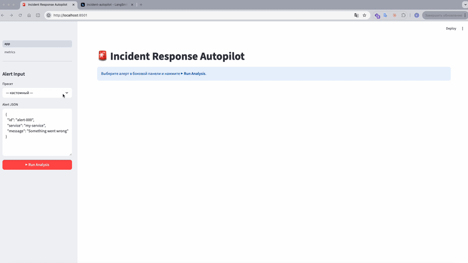
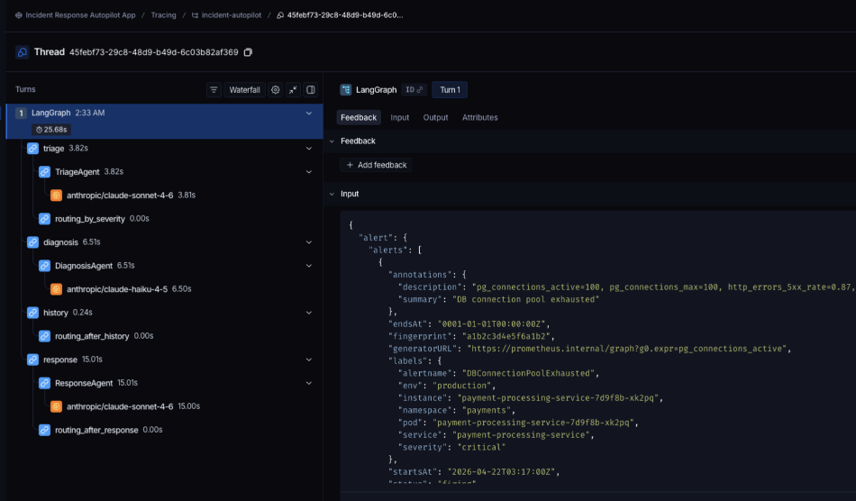
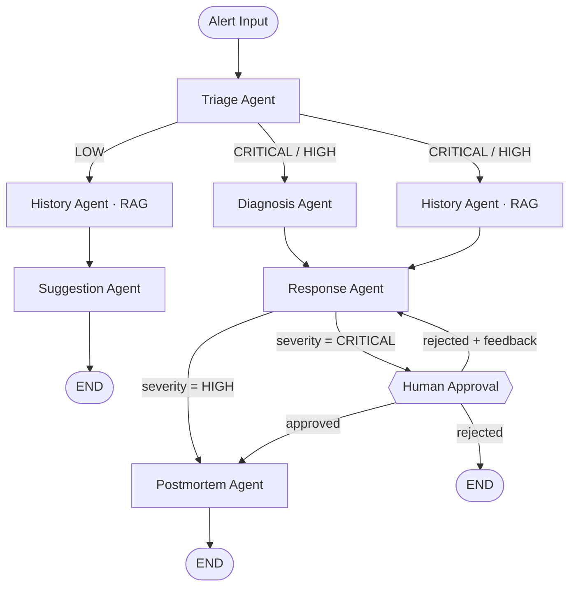

# Incident Response Autopilot

Учебный pet-проект для отработки трёх MAS-паттернов на LangGraph: conditional routing, fan-out/fan-in, human-in-the-loop. Доменом выбран incident response - близкая мне область из 17 лет в IT-управлении, последние из которых я отвечал за delivery и observability в продуктах крупного банка.

Цель проекта - не построить production-сервис, а пройти ключевые архитектурные паттерны мультиагентных систем на осмысленной задаче.

---

#### e2e сценарий на примере Alert уровня CRITICAL:

#### трассировка в langSmith:


---

## Мотивация

В предыдущей роли я ускорил диагностику инцидентов с 1–2 часов до 10–15 минут через стандартизацию метрик и повышение общего уровня observability в системах, без AI. Когда начал разбираться с LangGraph, захотелось посмотреть, как близкий по смыслу процесс ложится на MAS-архитектуру: где проходит граница между orchestrated workflow и автономными агентами, какие паттерны реально нужны для задачи.

Incident response для этого подходит хорошо: процесс понятный (triage → diagnosis → response → postmortem), есть маршрутизация в графе по severity, возможность применить human-in-the-loop, диагностика причины и поиск похожих инцидентов в истории (RAG) независимые операции и работают в параллель (fan-out/fan-in).

---

## Что есть и чего сознательно нет

| Есть                                                                                  | Сознательно за рамками (что добавил бы для production)                                         |
|---------------------------------------------------------------------------------------|------------------------------------------------------------------------------------------------|
| Orchestrated MAS на LangGraph: 5 LLM-агентов и RAG-узел                                           | Эксперимент с autonomous-агентами в отдельной ветке для сравнения trade-off с orchestrated-подходом                                                      |
| Условная маршрутизация по severity (CRITICAL / HIGH / LOW)                            | Интеграция с Alertmanager или аналогом → алерты передаются через UI в Streamlit                |
| Fan-out / fan-in (Diagnosis + History → Response) с кастомным reducer для мёржа состояний | Персистентный checkpointer → состояние графа в памяти процесса (`MemorySaver`)                 |
| Human-in-the-loop через interrupt + три исхода (approve / reject / reject + feedback) | Self-improving RAG - одобренные постмортемы возвращаются в knowledge base                      |
| RAG на локальной ChromaDB с идемпотентным ingestion                                   | Устойчивость и защита LLM-вызовов: retry, timeout, оборачивание недоверенного ввода в XML-теги |
| Структурированный вывод всех агентов через Pydantic v2 schemas                        | Автоматическая оценка качества (RAGAS, LLM-as-judge)                                           |
| LangSmith-трассировка для графа и JSONL-метрики (cost, latency по агентам)            | Полноценный бэкенд-API и фронтенд → UI на Streamlit                                            |
|               | Реальные runbook'и → данные синтетические        |

Слева - паттерны, которые я хотел закрепить на практике.
Справа - то, что реализовал бы для production уровня, а в учебном проекте лишнее.

---

## Граф агентов


```mermaid
flowchart TD
    START([Alert Input]) --> triage[Triage Agent]

    triage -->|CRITICAL / HIGH| diagnosis[Diagnosis Agent]
    triage -->|CRITICAL / HIGH| history_p[History Agent · RAG]
    triage -->|LOW| history_l[History Agent · RAG]

    diagnosis --> response[Response Agent]
    history_p --> response

    history_l --> suggestion[Suggestion Agent]
    suggestion --> END_LOW([END])

    response -->|severity = CRITICAL| approval{{Human Approval}}
    response -->|severity = HIGH| postmortem[Postmortem Agent]

    approval -->|approved| postmortem
    approval -->|rejected + feedback| response
    approval -->|rejected| END_REJECT([END])
    postmortem --> END_OK([END])
```

| Узел | Задача                                                      | Модель |
|---|-------------------------------------------------------------|---|
| `triage` | Классификация severity и типа инцидента                     | Claude Haiku 4.5 |
| `diagnosis` | RCA по симптомам алерта                                     | Claude Sonnet 4.5 |
| `history` | Семантический поиск похожих инцидентов в базе знаний        | (RAG, без LLM) |
| `response` | Сборка плана реагирования из диагноза + истории             | Claude Haiku 4.5 |
| `human_approval` | Interrupt-точка, граф ждёт ответа инженера                  | - |
| `postmortem` | Сборка постмортема: хронология инцидента и задачи по итогам | Claude Haiku 4.5 |
| `suggestion` | Рекомендации для LOW-инцидентов                             | Claude Haiku 4.5 |

Логика выбора моделей простая: Sonnet - там, где нужен reasoning; Haiku - там, где задача сводится к структурной трансформации входов в выход по фиксированной схеме. Кратно снижает стоимость и улучшает latency на инцидент без потери качества на нерассуждающих шагах.

Почему History Agent без LLM. RAG здесь: embed → cosine → top-k. LLM-слой поверх retrieval ничего не добавляет: финальную интерпретацию делает Response Agent, у которого уже есть и диагноз, и история. Чанкинг при ingestion устроен по смысловым границам Markdown (text.split("\n\n")), поэтому top-k уже возвращает читаемые самодостаточные фрагменты.

---

## Три паттерна и как они реализованы

### 1. Условная маршрутизация по severity

Граф ветвится в зависимости от severity. CRITICAL/HIGH идут через дорогой путь (Diagnosis + History параллельно → Response → Postmortem), LOW - через лёгкий (History → Suggestion). Реализация - `add_conditional_edges` и чистые routing-функции в [src/graph/routing.py](src/graph/routing.py), покрытые тестами в [tests/test_routing.py](tests/test_routing.py).

### 2. Fan-out / fan-in

Diagnosis и History запускаются одновременно, Response ждёт оба. Latency = `max(Diagnosis, History)`, а не сумма.

Неочевидное место: **параллельные узлы пишут в один dict в state, и LangGraph по умолчанию падает с ошибкой конкурентной записи**. Решение - кастомный reducer на поле `metrics`:

```python
# src/graph/state.py
class IncidentState(TypedDict, total=False):
    metrics: Annotated[dict[str, Any], _merge_dicts]   # reducer для fan-out
```

### 3. Human-in-the-loop через interrupt

Для CRITICAL граф останавливается перед узлом `human_approval`, ждёт решения инженера и продолжается через `Command(resume=...)`. Три исхода: approve → постмортем; reject + feedback → план перегенерируется с учётом замечаний; reject → END без постмортема.

---

## Latency и стоимость

9 прогонов на синтетических алертах (по 3 на каждый severity). Цифры показывают порядок величин и подтверждают экономическую разницу между путями графа (не качество предсказаний).

| Метрика                  | CRITICAL        | HIGH            | LOW              |
|--------------------------|-----------------|-----------------|------------------|
| End-to-end latency (сек) | 22 – 28     | 20 – 22     | 6 – 10       |
| Стоимость / инцидент ($) | 0,014 – 0,017   | 0,012 – 0,013   | 0,003 – 0,005    |
| Bottleneck               | Diagnosis Agent | Diagnosis Agent | Suggestion Agent |

LOW-ветка в 3–4 раза дешевле и в 2–3 раза быстрее CRITICAL - маршрутизация по severity окупается. Узкое место в тяжёлых ветках - Diagnosis на Sonnet.

Что по этим цифрам сказать нельзя - насколько корректна классификация, диагнозы и retrieval. Для этого нужен размеченный датасет, RAGAS и/или LLM-as-judge.

---

## Архитектурные решения

**LangGraph, а не LangChain AgentExecutor / CrewAI.** Высокоуровневые фреймворки удобны для линейных пайплайнов и прячут граф за абстракцией. Здесь нужен явный stateful граф с conditional edges, fan-out и interrupt - в LangGraph это базовые примитивы.

**Anthropic Claude API.** Нативный structured output через Pydantic-схему: ответ либо парсится в типизированную модель, либо SDK возвращает ошибку. Никакого ручного парсинга JSON. Распределение моделей по узлам - в разделе выше.

**ChromaDB embedded.** Без инфраструктуры. Идемпотентный ingestion: стабильный `sha256(path:chunk_idx)` как ID документа, повторная индексация не создаёт дубликатов. Логи retriever'а пишут query, top_k, scores и source_ids - заготовка под будущую RAGAS-evaluation.

**Pydantic v2 везде.** Каждый агент возвращает `BaseModel`, а не raw dict: валидация на стороне SDK, предсказуемые поля для следующих узлов, JSON-сериализация для логов и LangSmith из коробки.

**Streamlit как UI.** Достаточно для human-in-the-loop формы со стримингом обновлений. `graph.stream(stream_mode="updates")` + `st.status()` - узлы отрисовываются по мере готовности, fan-out видно как две параллельные колонки.

---

## О процессе разработки

Проект разработан с активным использованием Claude Code как coding-ассистента. Архитектурные решения, выбор паттернов LangGraph, обоснования trade-off'ов, декомпозиция на агенты - мои. Реализация прототипа, шаблонный код агентов, тесты - в значительной мере с помощью Claude Code. Весь сгенерированный код прочитан и местами переписан вручную.

Этот опыт мне нужен для следующей роли: управление командами, которые работают с AI-ассистентами, требует понимания инструментов изнутри (сильные и слабые стороны, ограничения).

---

## Стек

| Компонент | Технология |
|---|---|
| Оркестрация графа | LangGraph |
| LLM | Anthropic Claude API (Haiku 4.5 + Sonnet 4.5) |
| Structured output | Pydantic v2 |
| Векторная БД | ChromaDB embedded |
| UI | Streamlit |
| Tracing | LangSmith |
| Тесты | pytest + pytest-mock |
| Package manager | uv |

---

## Quick Start

```bash
# 1. Зависимости
uv sync

# 2. API-ключи
cp .env.example .env
# вписать ANTHROPIC_API_KEY=sk-ant-... (опционально LANGSMITH_API_KEY)

# 3. UI
uv run streamlit run ui/app.py

# 4. Тесты
uv run pytest
uv run pytest tests/test_routing.py -v
```

---

## Структура репозитория

```
src/
├── agents/                  # 5 LLM-агентов + history (RAG)
│   ├── <name>_schema.py     #  Pydantic-модель ответа
│   ├── <name>_prompts.py    #  system prompt + сборщик user prompt
│   └── <name>_agent.py      #  узел графа: messages.parse() + metrics
├── graph/
│   ├── state.py             # IncidentState (TypedDict с reducer для metrics)
│   ├── routing.py           # 4 чистые routing-функции
│   └── workflow.py          # сборка графа, interrupt_before, checkpointer
├── rag/
│   ├── ingestion.py         # ChromaDB ingestion (идемпотентный, sha256 ID)
│   └── retriever.py         # dense search + логи под RAGAS
├── monitoring/
│   └── metrics.py           # cost-калькуляция, агрегации, JSONL persistence
└── config.py                # pydantic-settings (.env)

ui/
├── app.py                   # main page: streaming + human-in-the-loop
└── pages/metrics.py         # дашборд cost / latency / approve-rate

data/sample_data/
├── incidents/               # 7 синтетических алертов (CRITICAL / HIGH / LOW)
└── knowledge_base/          # runbooks (7), postmortems (5), playbooks (4)

tests/
├── test_routing.py          # ветки графа
├── test_agents.py           # каждый LLM-агент с моком _llm
├── test_rag.py              # ingestion + retriever
└── test_metrics.py          # cost-калькуляция, агрегации
```

---
