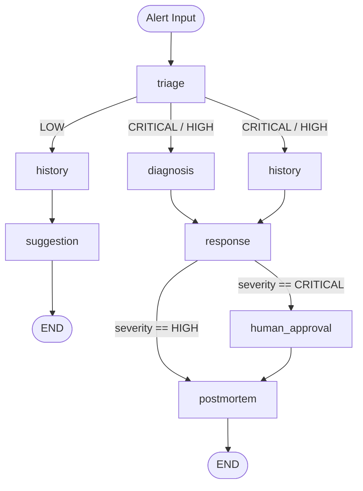

# Architecture: Incident Response Autopilot

Технический контракт для `langgraph-architect`. Описывает граф, state, routing и interrupt-точки.

---

## 1. Граф (Mermaid)



> `diagnosis` и `history` (ветка CRITICAL/HIGH) — параллельные узлы (fan-out). `response` — fan-in, ждёт оба.
> `interrupt_before=["human_approval"]` — граф останавливается до входа в узел.

---

## 2. IncidentState

```python
from typing import TypedDict, Any

class IncidentState(TypedDict):
    alert: dict[str, Any]        # исходный алерт от Alertmanager / JSON-файла
    severity: str                # CRITICAL | HIGH | LOW; заполняет triage
    incident_type: str           # performance | availability | data; заполняет triage
    diagnosis: str               # текстовый вывод DiagnosisAgent; заполняет diagnosis
    similar_incidents: list[dict[str, Any]]  # результат RAG-поиска; заполняет history
    response_plan: str           # план реагирования; заполняет response
    human_approved: bool         # True после подтверждения инженером; заполняет human_approval
    postmortem: str              # финальный текст постмортема; заполняет postmortem
    metrics: dict[str, Any]      # latency/tokens/cost per agent; каждый узел дописывает свой ключ
```

Все поля опциональны на старте — граф заполняет их последовательно. Начальный state содержит только `alert`.

---

## 3. Таблица узлов

| Узел | Модуль агента | Читает из state | Пишет в state | Следующие узлы |
|---|---|---|---|---|
| `triage` | `agents/triage_agent.py` | `alert` | `severity`, `incident_type`, `metrics["triage"]` | `diagnosis` + `history` (CRITICAL/HIGH) или `history` (LOW) |
| `diagnosis` | `agents/diagnosis_agent.py` | `alert`, `severity`, `incident_type` | `diagnosis`, `metrics["diagnosis"]` | `response` (fan-in) |
| `history` | `agents/history_agent.py` | `alert`, `severity`, `incident_type` | `similar_incidents`, `metrics["history"]` | `response` (fan-in, CRITICAL/HIGH) или `suggestion` (LOW) |
| `response` | `agents/response_agent.py` | `alert`, `severity`, `diagnosis`, `similar_incidents` | `response_plan`, `metrics["response"]` | `human_approval` (CRITICAL) или `postmortem` (HIGH) |
| `human_approval` | `graph/workflow.py` (interrupt node, без LLM) | `response_plan` | `human_approved` | `postmortem` |
| `postmortem` | `agents/postmortem_agent.py` | `alert`, `severity`, `diagnosis`, `similar_incidents`, `response_plan`, `human_approved` | `postmortem`, `metrics["postmortem"]` | END |
| `suggestion` | `agents/suggestion_agent.py` | `alert`, `similar_incidents` | `response_plan`, `metrics["suggestion"]` | END |

---

## 4. routing_by_severity (псевдокод)

```python
# src/graph/routing.py

def routing_by_severity(state: IncidentState) -> list[str]:
    """Conditional edge после узла triage. Возвращает список следующих узлов."""
    severity = state["severity"]

    if severity == "CRITICAL":
        # fan-out: оба узла запускаются параллельно
        return ["diagnosis", "history"]

    if severity == "HIGH":
        # fan-out: оба узла запускаются параллельно
        return ["diagnosis", "history"]

    if severity == "LOW":
        # только history → suggestion, diagnosis не нужен
        return ["history"]

    raise ValueError(f"Unknown severity: {severity!r}")


def routing_after_response(state: IncidentState) -> str:
    """Conditional edge после узла response."""
    if state["severity"] == "CRITICAL":
        return "human_approval"
    return "postmortem"


def routing_after_history_low(state: IncidentState) -> str:
    """Conditional edge после узла history в LOW-ветке."""
    # history используется в двух ветках; routing определяется severity
    if state["severity"] == "LOW":
        return "suggestion"
    # CRITICAL/HIGH: history — fan-out нода, LangGraph направит в response через fan-in
    return "response"
```

---

## 5. Точки interrupt

| Узел | Условие активации | Что ждёт граф | Условие возобновления |
|---|---|---|---|
| `human_approval` | `severity == "CRITICAL"` | Внешний вызов `graph.update_state(thread_id, {"human_approved": True/False})` | `human_approved` присвоен (True или False) |

**Конфигурация в `workflow.py`:**
```python
graph = builder.compile(
    interrupt_before=["human_approval"],
    checkpointer=checkpointer,  # обязателен для interrupt
)
```

**Поведение при `human_approved = False`:** граф завершается без запуска `postmortem`. Реализуется через дополнительный conditional edge из `human_approval`:
```python
def routing_after_human_approval(state: IncidentState) -> str:
    if state["human_approved"]:
        return "postmortem"
    return END
```
